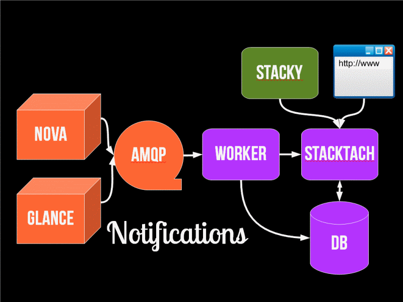

An Introduction to StackTach
============================

StackTach was initially created as a browser-based debugging tool
for OpenStack Nova. Since that time, StackTach has evolved into a
tool that can do debugging, performance monitoring and perform
audit, validation and reconcilation of Nova and Glance usage in a
manner suitable for billing.

How it works
************

Nearly all OpenStack components are capable of generating
*notifications* when significant events occur. Notifications
are messages placed on the OpenStack queue (generally RabbitMQ)
for consumption by downstream systems.

The OpenStack wiki has info on the `notification format`_.

.. _notification format: http://wiki.openstack.org/SystemUsageData

StackTach has a *worker* that is configured to read these notifications
and store them in a database (ideally a database separate from the
OpenStack production database). From there, StackTach reviews the stream
of notifications to glean usage information and assemble it in an
easy-to-query fashion.

Users can inquire on instances, requests, servers, etc using the
browser interface or command line tool (`Stacky`_).

.. _Stacky: https://github.com/rackerlabs/stacky

To get a general sense of notification adoption across OpenStack projects `read this blog post`_

.. _read this blog post: http://www.sandywalsh.com/2013/09/notification-usage-in-openstack-report.html